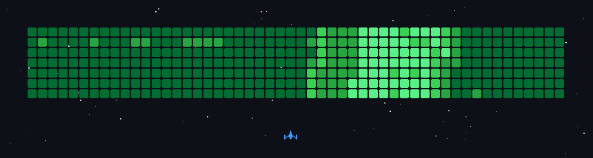

 

Full-stack engineer with **9+ years** of experience. Collaborated with **15+ major tech companies** across the US, UK, and Europe. Designed and built premium internal business tools that power real operations — and consumer products used by millions.

I reach for whatever the problem demands: systems-level Rust, cloud-native Go, native iOS with SwiftUI, or a React frontend shipped in a day. The language is a detail. The solution is everything.

**Now building** [`SendBolt`](https://ajmaljs.com) — AI-powered email design, built with Claude.

---

## Stack

---

## Numbers

---

## Activity

---

## Contributions

---

